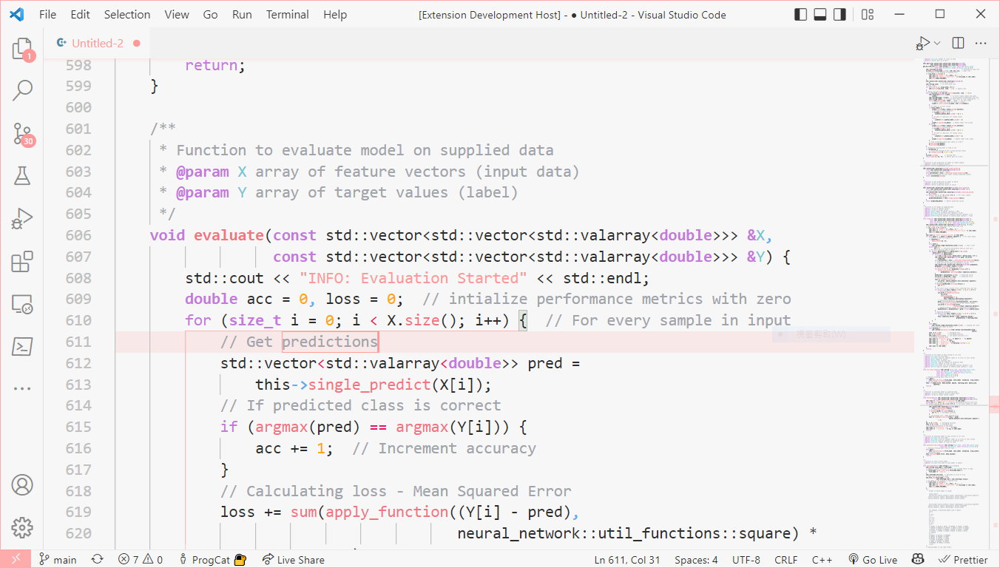

# True Pink Theme

A light **pink** theme for VS Code, built around one rule: *every colour means one thing, consistently across every language.* Keywords are always purple, functions always dark pink, strings always pink — so your code stays visually coherent whether you're writing C, Python, Rust or SQL.

> Splashing pink on your screen doesn't make a good pink theme. This one is tuned token by token.

## Screenshot

## Colour roles

- **Purple** — keywords, control flow, storage, and primitive types (like C's `int`)
- **Dark pink** — functions (definition & call)
- **Pink** — strings, `this` / `self`
- **Light blue** — compound / user-defined types
- **Cyan** — parameters, language constants (`true` / `false` / `null`)
- **Orange** — numbers, literals, escapes
- **Gold** — constants & macros
- **Green** — decorators, directives, preprocessor
- **Red** — comparison operators
- **Black** — variables, operators, member access
- **Grey** — comments

## Supported languages

C · C++ · Python · VHDL · Markdown · TypeScript · JavaScript · CSS · HTML · JSON · YAML · XML · Rust · Go · Java · PHP · Shell · SQL · Ruby

- **TOML** — needs a TOML extension (e.g. *Even Better TOML*); VS Code ships no built-in TOML grammar.
- **C#** — partial support (work in progress).

## Install

Search **True Pink** in the Extensions view (or run `ext install ProgCat.truepink`), then pick **TruePink** under your colour theme.

> We like pink.
